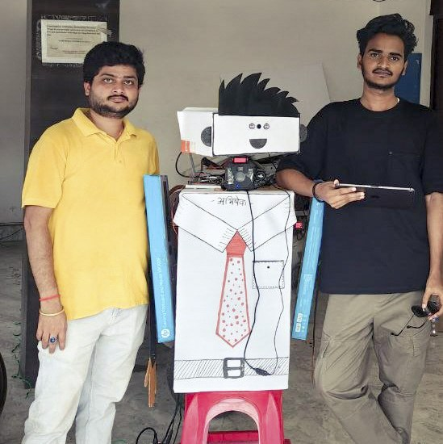
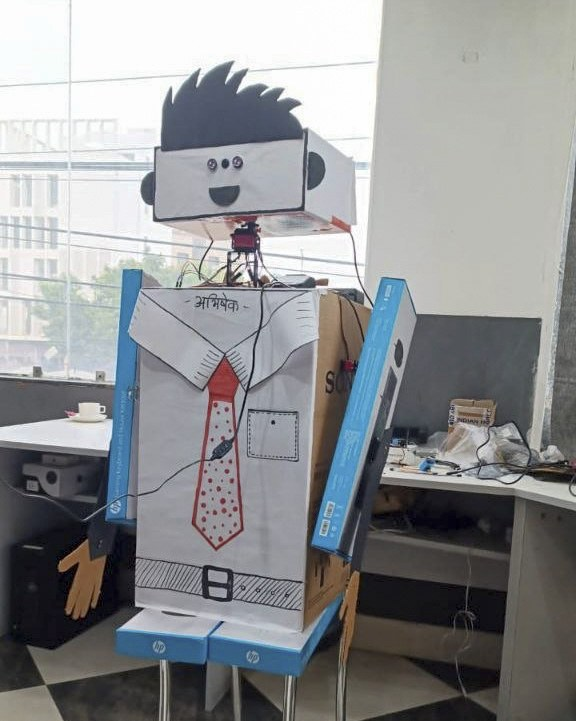
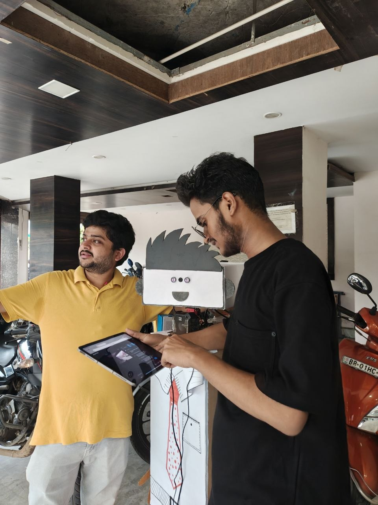
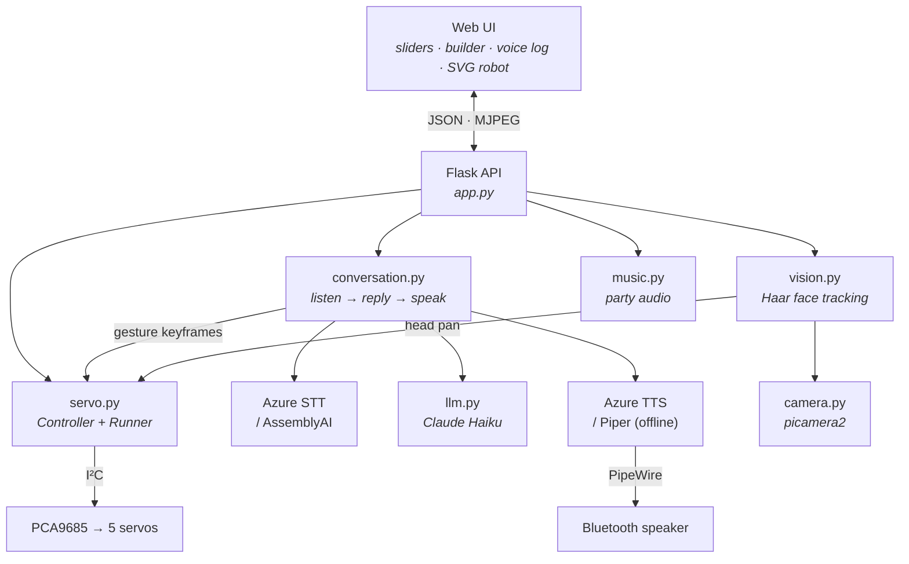

<div align="center">

# Artyom Robo

**A conversational desk robot on a Raspberry Pi**

Five servos, speech in three languages, and arm gestures
generated from the sentence being spoken.

[](https://github.com/geekksv/artyom-robo/actions/workflows/ci.yml) [](LICENSE) [](pyproject.toml)

<sub>Raspberry&nbsp;Pi · PCA9685 · Flask · Claude · Azure&nbsp;Speech · OpenCV</sub>

<br>

### [Try it in your browser&nbsp;→](https://geekksv.github.io/artyom-robo/)

<sub>An on-screen robot running this project's own code. No hardware, no API key.</sub>

<br>



</div>

---

## Overview

Five hobby servos and a Raspberry Pi in a cardboard chassis, driven by a Flask app.
It holds a spoken conversation in Indian English, Hindi or Bhojpuri and answers in the
language it was addressed in, gesturing with its arms as it speaks. It tracks a face
with its head, and turns plain-English instructions into servo motion.

Two things are worth reading the code for. **Arm gestures are derived from the
structure of the reply** rather than animated at random, and **motion sequences are
generated under a JSON schema**, so the model cannot return anything the robot can't
run. Both are explained below, and both run in the browser demo.

<table>
<tr>
<td width="50%"></td>
<td width="50%"></td>
</tr>
<tr>
<td align="center"><sub><em>Head on a pan servo, two box arms, camera at the neck</em></sub></td>
<td align="center"><sub><em>Driven from a browser on the same network</em></sub></td>
</tr>
</table>

---

## What it does

|  | |
|---|---|
| **Live servo control** | Sliders per channel, with an on-screen robot mirroring the hardware in real time. |
| **Sequence builder** | Pose the robot, capture the pose as a step, set `move_time` / `hold`, save it by name. 12 sequences ship built in. |
| **Motion from plain English** | *"nod twice, then wave with your right arm"* → Claude Haiku returns a sequence in the app's own step format, loaded into the builder to tweak or run. |
| **Bilingual conversation** | Hold a spoken conversation in Indian English, Hindi or Bhojpuri. The robot replies in whichever language you used. |
| **Gestures synced to speech** | While speaking, the arms follow a keyframe timeline derived from the reply text — timed against the measured audio length. |
| **Face tracking** | A Haar cascade on the camera's low-res stream pans the head to keep your face centred. |
| **Party mode** | Picks a dance sequence and plays a song — or, with no audio files present, a beat it synthesizes from scratch with numpy. |

Every feature degrades gracefully. No camera, no API key, no microphone, no Bluetooth
speaker — each subsystem reports `available = False`, `/api/state` says so, and the UI
hides that panel. The app always starts.

---

## Running it

**In a browser** — [geekksv.github.io/artyom-robo](https://geekksv.github.io/artyom-robo/).
Loads the real `default_sequences.json`, runs a JS port of the same 20 ms easing loop,
generates gestures with the same algorithm, and synthesizes the same party beat in
WebAudio. Nothing is faked and nothing is downloaded.

**On your laptop** — the hardware libraries are optional. Without them the controller
drops into MOCK mode with the full UI intact:

```bash
git clone https://github.com/geekksv/artyom-robo && cd artyom-robo
pip install flask httpx numpy
python app.py            # → http://localhost:8000
```

**On the Pi** — `./deploy.ps1` copies everything to `/opt/artyom-robo`, builds a venv
with `--system-site-packages` so `picamera2` and `ServoKit` come from the OS, and
restarts the systemd unit.

<details>
<summary><b>Deployment details, API keys and speech engines</b> — what to install on the Pi, and which keys unlock which feature</summary>

<br>

```powershell
./deploy.ps1                              # or: ./deploy.ps1 -Target root@192.168.1.20
ssh pi journalctl -u artyom-robo -f       # follow the logs
```

System packages the Pi needs: `alsa-utils` (`arecord`), `pipewire` (`pw-play`), and
`ffmpeg` if you want to play your own audio files in party mode.

### API keys

Optional — each one enables a feature, and the UI adapts to whatever is set. Create
`/opt/artyom-robo/.env` (see [`.env.example`](.env.example)):

```bash
ANTHROPIC_API_KEY=sk-ant-...     # natural-language motion + conversation
AZURE_SPEECH_KEY=...             # speech in/out (fast, multilingual)
AZURE_SPEECH_REGION=eastus
ASSEMBLYAI_API_KEY=...           # only if stt_engine = "assemblyai"
```

With no keys at all you still get live control, the sequence builder, saved sequences,
the camera stream and party mode.

### Speech engines

Both speech layers are swappable behind one interface, chosen in `config.json`:

| | `"azure"` | alternative |
|---|---|---|
| `tts_engine` | Azure Neural voices, multilingual | `"piper"` — fully local and offline |
| `stt_engine` | Azure short-audio recognition | `"assemblyai"` |

The reply voice is chosen by **script detection**, not by the dropdown: a reply
containing Devanagari is spoken by a Hindi voice even when the UI is set to English,
so a code-mixed conversation sounds right.

</details>

---

## How it works



### Gestures come from the sentence, not from a random wiggle

The obvious way to make a robot "talk with its hands" is a random loop. That reads as
noise. Instead, `talk_keyframes()` builds a timeline from the reply text itself:

- one beat per word, spread across the measured audio duration, so gestures track the
  rhythm of speech
- amplitude grows with word length — longer, more emphatic words get bigger beats
- `!` and `?` are *strong*: every arm is thrown, not just the leading one
- commas and semicolons produce a brief partial settle
- full stops relax to rest and **swap which arm leads**, so consecutive sentences don't
  look mechanical

```python
keys = talk_keyframes(reply, duration, arms)   # [(t_seconds, {channel: angle}), ...]
```

The audio is synthesized to a file first so its exact duration is known, then playback
and the gesture timeline start together — offset by a configurable `gesture_delay` that
compensates for `pw-play` startup and Bluetooth A2DP latency. Get that wrong and the
robot gesticulates half a second ahead of its own voice.

It is deterministic, so it is unit-tested. The browser demo runs the same function —
type *"Wow! Really? Yes, absolutely incredible."* and watch both arms fire on the
punctuation, then the lead swap after the full stop.

### The LLM cannot emit an unrunnable sequence

`llm.py` builds a JSON schema **from the live channel list** — one required integer per
`chN`, plus `move_time` and `hold`, with `additionalProperties: false` — and passes it
as a structured-output constraint. There is no parsing, no retry loop, and no "the
model returned prose today" failure mode. Change `channels` in `config.json` and the
schema, the system prompt and the validation all follow.

### Three transforms sit between a command and a servo

`Controller.set_angle()` is the only path to the hardware, and it applies, in order:

1. **`limits`** — per-channel safe travel, so a shoulder can't drive into a hard stop
2. **`invert`** — mirror-mounted channels get `180 − angle`, so one logical command
   moves both arms the same visual direction
3. **`park_channels`** — a continuous-rotation servo can't hold an angle at all (90
   means *stopped*, anything else means *spin*), so it is pinned to neutral

---

## Hardware

<div align="center">

</div>

The split that matters: **the Pi never carries servo current.** Four jumpers from its
header (pins 1, 3, 5, 6) give the PCA9685 logic power and I²C, and that is all they do.
Every amp the servos draw comes from the SMPS, straight into the driver's screw terminal
with nothing in between. The two meet at the driver's ground — and they have to, or the
PWM has no reference and the servos twitch.

Channels: `0` head pan · `1`/`2` right shoulder + elbow · `3`/`4` left shoulder + elbow.
The arms are flat panels hinged at the top corners of the torso, so they lift forward
and up — there is no sideways travel.

<details>
<summary><b>Full parts list</b> — what was bought, and what it cost</summary>

<br>

| Part | Category | Spec |
|---|---|---|
| Digital servo motor | Motor | 20 kg load — head, both elbows |
| Digital servo motor | Motor | 40 kg load — both shoulders |
| SMPS | Power | 5 V 40 A — feeds the driver directly |
| PCA9685 servo driver | Driver | 16-channel PWM, I²C `0x40` |
| Servo tester | Tool | CCPM — find each servo's real travel before wiring |
| Servo mount brackets | Chassis | multi-purpose and U type |
| 6 mm coupler | Chassis | shaft coupling |
| M3 × 20 mm brass hex spacers | Chassis | standoffs |
| M3 × 60 mm brass hex spacers | Chassis | standoffs |
| Screws, nuts | Chassis | assorted |
| Jumper wire | Wiring | I²C and signal |
| Glue gun | Tool | assembly |

**₹16,899 for the lot.** The Raspberry Pi, CSI camera, USB microphone and Bluetooth
speaker were already to hand and aren't in that figure. The chassis is cardboard boxes,
glue and marker pens. A pair of step-down converters was bought early on and ended up
unused — the SMPS drives the servos at 5 V directly.

A servo tester earns its place: run each servo through its range before it is bolted in,
then narrow `min_pulse` / `max_pulse` in `config.json` for any that buzz or strain at the
extremes.

</details>

---

## Reference

<details>
<summary><b>Configuration</b> — every <code>config.json</code> key and what it controls</summary>

<br>

Everything hardware-shaped lives in [`config.json`](config.json).

| Key | Meaning |
|---|---|
| `channels`, `names` | which PCA9685 channels are wired, and what to call them |
| `min_pulse`, `max_pulse` | pulse width µs for a full sweep — narrow these if a servo strains |
| `limits` | per-channel safe travel, e.g. `{"1": [40, 180]}` |
| `invert` | mirror-mounted channels |
| `park_channels` | continuous-rotation servos, pinned to neutral |
| `arms` | `[[shoulder, elbow], ...]` used for gesturing |
| `speech_language`, `speech_languages` | active language and the selectable table |
| `wake_word`, `wake_sleep_after` | wake phrase, and silent turns before sleeping again |
| `gesture_delay` | seconds between playback starting and gestures starting |
| `face_track_gain`, `face_track_deadzone` | head-tracking control loop |
| `party_dances`, `party_dance_seconds` | which sequences party mode picks from |

Inconsistent config is reported at startup rather than failing silently — for example,
a channel that is both parked and listed in `arms` would drop every gesture written to
it.

</details>

<details>
<summary><b>HTTP API</b> — all 19 routes</summary>

<br>

| Method | Path | Body / effect |
|---|---|---|
| `GET` | `/api/state` | channels, names, angles, and every feature's availability |
| `POST` | `/api/servo/<ch>` | `{angle}` — move one servo |
| `POST` | `/api/servos` | `{angles:{ch:deg}}` — move several |
| `POST` | `/api/center` | all servos to the start angle |
| `GET` | `/api/sequences` | all saved sequences |
| `POST` | `/api/sequences` | save `{name, loop, steps}` |
| `DELETE` | `/api/sequences/<name>` | delete |
| `POST` | `/api/sequences/<name>/run` | run a saved sequence |
| `POST` | `/api/run` | run an unsaved sequence body |
| `POST` | `/api/stop` | stop everything |
| `POST` | `/api/llm` | `{prompt, run}` — text → sequence |
| `POST` | `/api/voice` | `{seconds, generate, run, speak}` — mic → text → sequence |
| `POST` | `/api/say` | `{text}` — speak arbitrary text |
| `POST` | `/api/conversation` | `{on, wake}` — toggle continuous talk mode |
| `POST` | `/api/face_track` | `{on}` — toggle head tracking |
| `POST` | `/api/language` | `{id}` — switch speech language live |
| `POST` | `/api/party` | `{on}` — dance + music |
| `GET` | `/camera/stream` | MJPEG stream |
| `GET` | `/camera/snapshot` | single JPEG |

</details>

<details>
<summary><b>Development</b> — tests, linting and the repository layout</summary>

<br>

```bash
pip install -r requirements-dev.txt
pytest                              # motion, gestures, intents, speech, schema
ruff check .
python tools/sync_demo_data.py      # refresh the browser demo's copy of the real data
```

The tests run with no hardware attached — the same MOCK path a laptop takes — and cover
the angle transforms, sequence interpolation, the gesture timeline, multilingual intent
matching and the LLM schema. CI runs them on Python 3.11–3.13 and verifies the demo's
data hasn't drifted from the robot's.

```
app.py                 Flask API + feature wiring
servo.py               Controller (limits/invert/park) + Runner (sequence engine)
conversation.py        talk loop + talk_keyframes()
llm.py                 Claude: sequence generation and chat
azure_speech.py        Azure TTS/STT + the language manager
speak.py / voice.py    Piper TTS / AssemblyAI STT
vision.py, camera.py   face tracking, MJPEG camera
music.py               party audio (files, or synthesized)
intents.py             multilingual dance/stop command matching
static/                the web UI, and robot.js — the SVG robot
docs/                  the browser demo (GitHub Pages)
```

</details>

---

## Limitations

- **You can cut the robot off, but only by hand.** Stop in the UI kills the sentence
  mid-word — playback is a child process the stop path terminates — and the arms settle
  at once. What you *can't* do is interrupt by talking: the mic stays closed while the
  robot speaks, so there is no barge-in.
- **Listening is turn-based, not streaming.** The mic records a fixed 4-second clip,
  then stops to think, so a two-word answer still waits out the whole window. Streaming
  STT is the single biggest improvement left.
- **Four subsystems write to the same servo bus.** The sequence runner, the face
  tracker and the gesture loop are coordinated by explicit hand-offs — a sequence that
  pans the head borrows it from the tracker and gives it back. A priority-based arbiter
  would be cleaner than hand-offs at each call site.
- **Wake-word detection is cloud-side**, so wake mode round-trips every 4-second clip
  to Azure just to check for one phrase. An on-device wake word (openWakeWord,
  Porcupine) would cut both cost and latency.
- **No authentication, and it runs as root** on the Flask development server. A
  deliberate choice for a LAN-only appliance that needs I²C and PipeWire access — but
  not something to expose to the internet.
- **Head tracking is pan-only.** One servo, so it follows left/right and ignores
  height.

---

<div align="center">

Built by [geekksv](https://github.com/geekksv) and [princeranjan279](https://github.com/princeranjan279) · [MIT](LICENSE)

</div>
